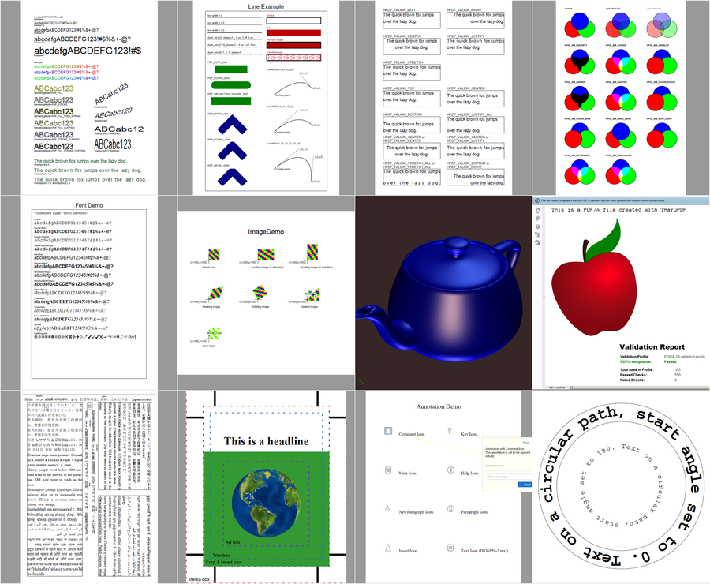

# THaruPDF

THaruPDF is a Object Pascal binding for [libharu](http://libharu.org/) - free, open source library for generating PDF files.

## libharu binary
THaruPDF uses a modified version of libharu that was compiled with Embarcadero BCC32C C++ Compiler. Modified [libharu](https://github.com/r1me/libharu) include multiple patches made by community and its latest build can be found in this repository in `bin\libhpdf.dll`.

## Examples
Tested in Delphi 10.2 Tokyo Starter (**32-bit**) and Lazarus 1.8 in Windows. 

   - `examples\delphi-vcl`. Main demo in Delphi. 20+ examples of usage. Find source code of them in `examples\delphi-vcl\demo\`  
   

   - `examples\delphi-console`. Simple console example: create single page document, write some text and draw an image.
   - `examples\lazarus-console`. `examples\delphi-console` but for Lazarus.

## License
MIT
